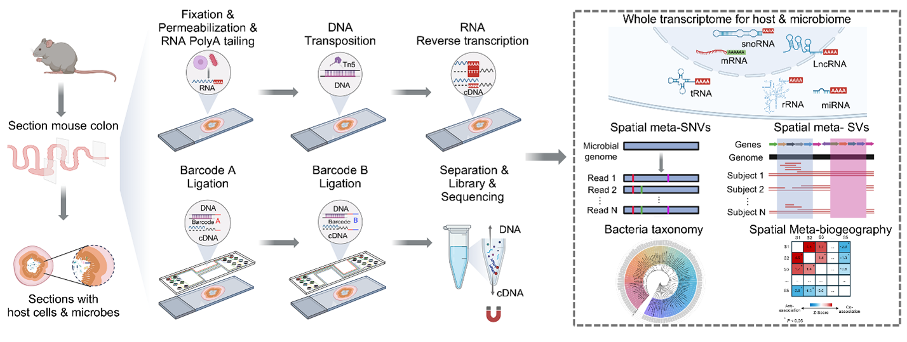

# MicroGT-DBiT

**MicroGT-DBiT** is a spatial metagenomics pipeline for mapping microbial communities across tissue coordinates using [DBiT (Deterministic Barcoding in Tissue)](https://www.nature.com/articles/s41586-020-2892-8) sequencing technology. It processes spatially-barcoded DNA and RNA sequencing data to generate spatially-resolved abundance profiles of bacterial species and detect strain-level genetic variation.

## Overview



DBiT-seq applies a grid of spatial barcodes to tissue sections before sequencing. MicroGT-DBiT decodes those barcodes, maps reads to microbial reference genomes, and produces feature-by-spot matrices analogous to spatial transcriptomics outputs — but for the microbiome.

**Key capabilities:**
- Spatially-resolved bacterial species quantification (DNA and RNA)
- Single nucleotide variant (SNV) detection with spatial resolution
- Structural variant (SV) detection across samples
- Taxonomic classification of host-depleted reads
- Publication-quality spatial visualization and colocalization analysis

## Repository Structure

```
MicroGT-DBiT/
├── DNA_analysis/          # Spatial barcode demultiplexing and DNA read mapping
├── RNA_analysis/          # Spatial RNA processing using ASTRO
├── SNV_analysis/          # Single nucleotide variant detection
├── SV_analysis/           # Structural variant detection
├── kraken2/               # Taxonomic classification of host-depleted reads
├── Data_visualization/    # R scripts for spatial plotting and colocalization
└── test_data/             # Example data for pipeline testing
```

## Typical Workflow

```
Raw paired-end FASTQ (R1 + R2)
        │
        ├──► kraken2/          Taxonomic classification (host depletion → species ID)
        │
        ├──► DNA_analysis/     Demultiplex spatial barcodes → map to reference → contig × spot matrix
        │
        ├──► RNA_analysis/     Spatial RNA quantification (barcode decode + STAR mapping via ASTRO)
        │
        ├──► SNV_analysis/     Barcode-tagged BAM → inStrain SNV profiling per spot
        │
        ├──► SV_analysis/      SGVFinder2 structural variant calling across samples
        │
        └──► Data_visualization/  Species heatmaps, colocalization statistics
```

## Input Data

| File | Description |
|------|-------------|
| `*_R1.fastq.gz` | Sequencing read 1 (DNA/RNA transcript reads) |
| `*_R2.fastq.gz` | Sequencing read 2 (contains spatial barcodes) |
| `spatial_barcodes.txt` | Barcode whitelist mapping `BARCODE_B+BARCODE_A → X Y` coordinates |
| `position.txt` | List of valid tissue spot coordinates to retain |
| Reference genome | FASTA file of bacterial reference sequences |
| `host_plus_bac.gtf` | GTF annotation combining host and bacterial genes (RNA only) |

## Output Data

| File | Description |
|------|-------------|
| `expmat_contig.tsv` | Contig × spot abundance matrix (DNA) |
| `*.sorted.bam` | Coordinate-sorted BAM with spatial spot tags |
| `std.report` | Kraken2 taxonomic classification report |
| `variable_sgv.pkl` / `deletion_sgv.pkl` | SGVFinder2 structural variant tables |
| `species_spatial_plots/` | PNG heatmaps of species abundance across tissue |

## Dependencies

**Alignment & mapping:** BWA-MEM2, Bowtie2, STAR, samtools

**Taxonomic & variant analysis:** Kraken2, inStrain, SGVFinder2

**RNA processing:** ASTRO (run via conda environment `astro`)

**Python packages:** `regex`, `pandas`, `sgvfinder2`

**R packages:** `data.table`, `ggplot2`, `ragg`, `EcoSimR`

## Quick Start

See each subdirectory's README for module-specific instructions. Test data is provided in `test_data/` for validating the pipeline on a small example dataset.

## Citation

If you use MicroGT-DBiT in your research, please cite the associated publication (see `Read Me.docx` for details).
